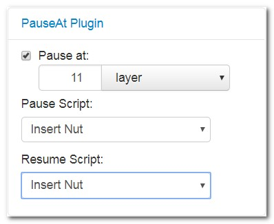

# OctoPrint-PauseAt

** WORK IN PROGRESS **

Plugin that pause the print at a specific layer or hight, executes a defined G-Code script, wait for user resume-action and execute a resume G-Code script.

## Setup

Install via the bundled [Plugin Manager](https://github.com/foosel/OctoPrint/wiki/Plugin:-Plugin-Manager)
or manually using this URL:

    https://github.com/OllisGit/OctoPrint-PauseAt/archive/master.zip

**TODO:** Describe how to install your plugin, if more needs to be done than just installing it via pip or through
the plugin manager.

## Configuration

**TODO:** Describe your plugin's configuration options (if any).

schmierzettel
M400 -> pause print
M110 N0 -> resume print
